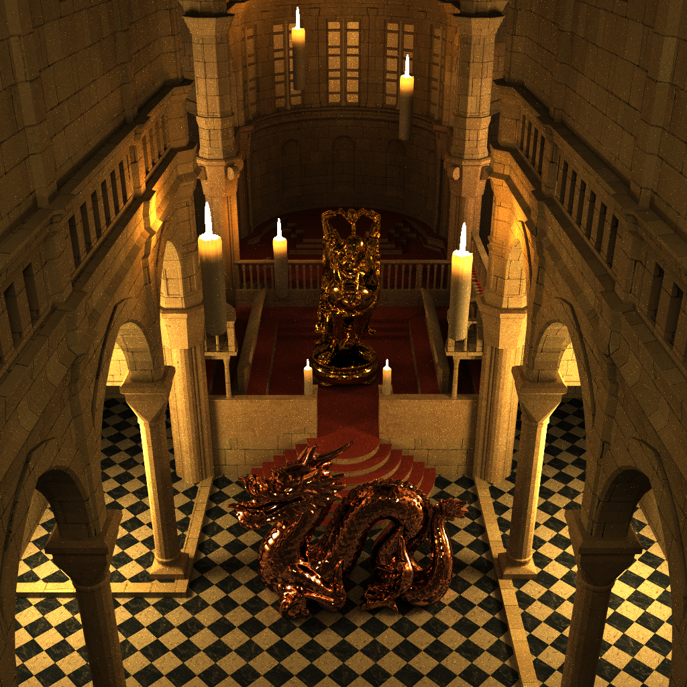
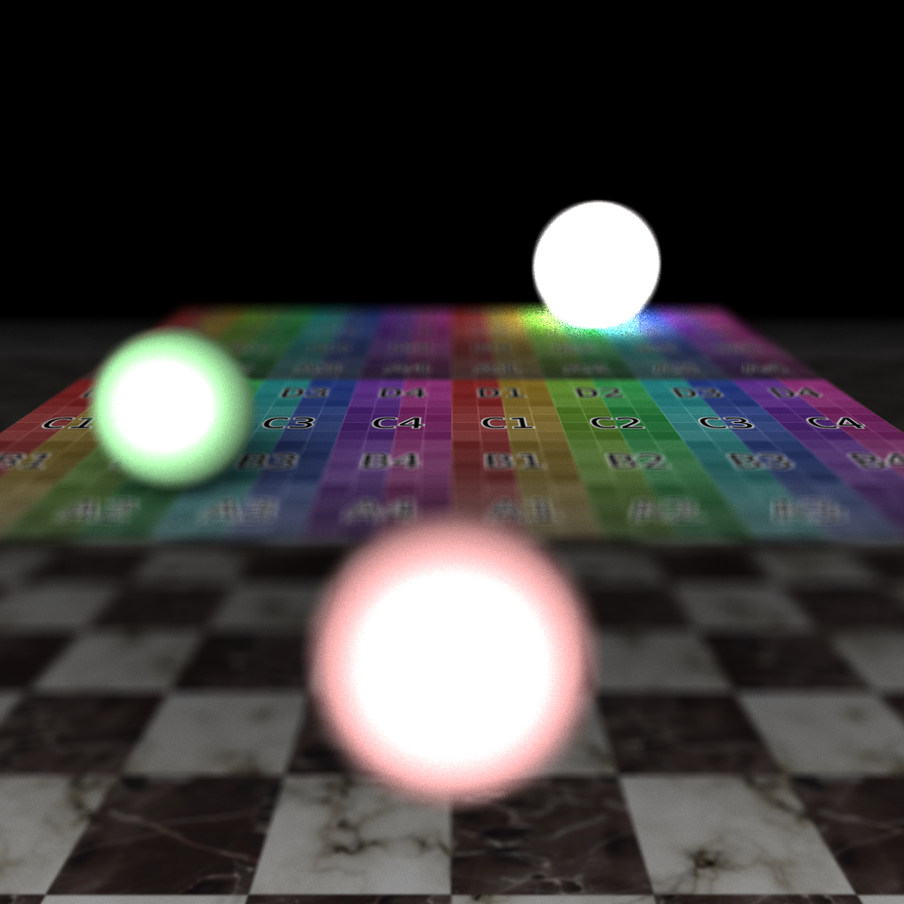
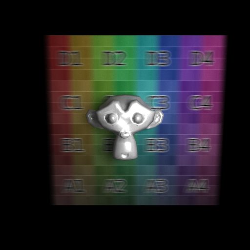
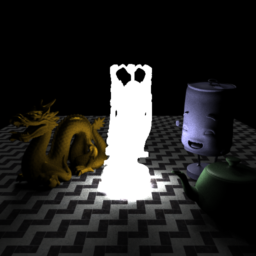
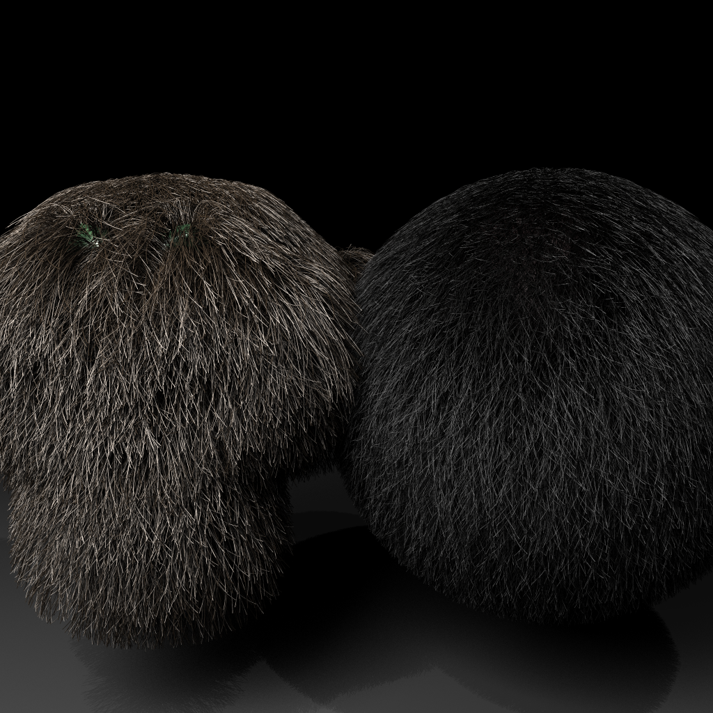
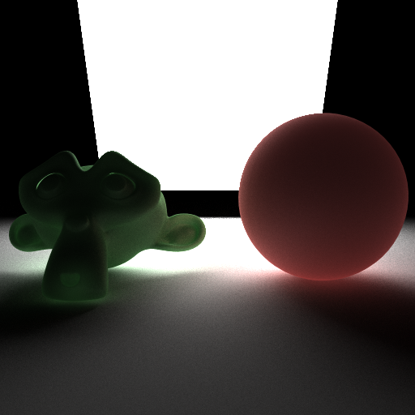
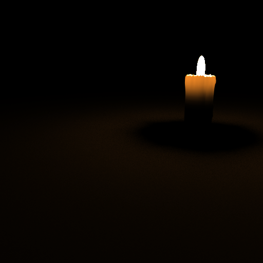
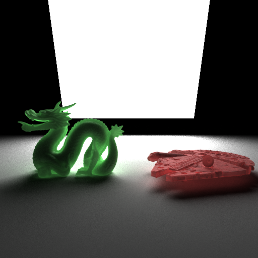

# Assignment 4: Pathtrace

Realistic pathtracer implementation in C++ with depth of field, motion blur, mesh area light sampling, russian roulette (for faster ray termination), hair rendering and skin rendering (translucency). 

Developed in the context of the fourth homework of the fundamentals of computer graphics course held by Prof. Fabio Pellacini.

### Introduction

In your fifth assignment, you will implement a pathtracer. You will see that with a small amount of code, we can produce realistic images.

### Requirements

You are to implement the code left blank in `pathtrace.cpp`. In this homework, we will provide code for a standard raytracer that you can modify to reach the pathtracer. You will implement these features.

1. Basic random tracer. Modify the standard raytracer to use a random number generator to set up the samples in the pixel.
2. Textures. Implement bilinear texture lookup in the renderer. Foreach material property, scale the material value by the texture if present.
3. Area lights. Implement area light sampling for quad surfaces. Use uniform sampling over the quad surface for this.
4. Environment illumination. Implement environment mapping by first looking up the environment map if a camera ray misses. Then implement environment lighting by sampling the brdf with the supplied function `sample_brdf`. Using this direction sample the environment light.
5. Microfacet materials. Implement a microfacet modification to Blinn-Phong illumination.
6. Indirect illumination. Implement recursive path tracing by shooting rays in the direction given by `sample_brdf`; stop recursion based on `path_max_depth`.
7. Create a complex and interesting scene. Create an interesting scene by using the models supplied before in class or new ones. We include in the distribution a Python script that converts OBJ files to JSON. The script is in no way robust. We have tested it with Blender by exporting the entire scene with normals checked.
8. To document the previous point and to support extra credit, please attach to your submission a PDF document that includes the images you generated, and the rendering features shown.

### Extra Credit

Pick the ones that are most interesting to you. In general the easiest to implement are less interesting than the hard ones.

1. [easy] Implement depth of field.

   

2. [hard] Implement motion blur.

   

3. [medium] Implement mesh area light sampling. To do so, you have to pick a uniformly distributed random point on a Mesh. This can be done in the same manner as picking points for growing hair in homework02.

   

4. [easy] Implement russian roulette for faster ray termination.

5. [hard] Implement hair rendering. Implement ray-line intersection by treating each line segment as a small cylinder. Use Kajiya-Kay as the BRDF.

   

6 [very hard] Implement skin rendering. Contact the professor.

